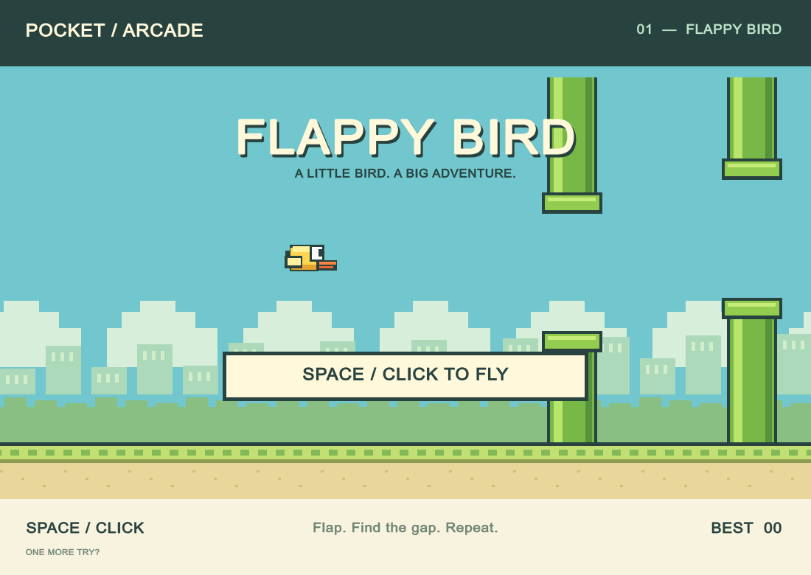

# Flappy Bird — Pocket Arcade

A playable Unity 6 recreation with procedural pixel art, scrolling pipes, gravity and flap movement, collision detection, score tracking, persistent best score, and instant restart.

Open `Build/Flappy Bird.app` to play. Press **Space** or **left click** to start, flap, or restart after a crash.

To edit, open this folder in Unity 6000.6.0f1 and open `Assets/FlappyBird.unity`.

To test and build, run the Unity editor with `-batchmode -nographics -projectPath <project-path> -executeMethod BuildGame.Build -quit`. The build entry point checks thirteen flight, collision, and layout cases before generating the scene and producing the macOS app. The centered viewport preserves the artwork's proportions when resizing; scenery freezes on game over.

The app captures `Build/screenshot.png` after its first 100 frames. Art is drawn procedurally; no downloaded art or external packages are required.
